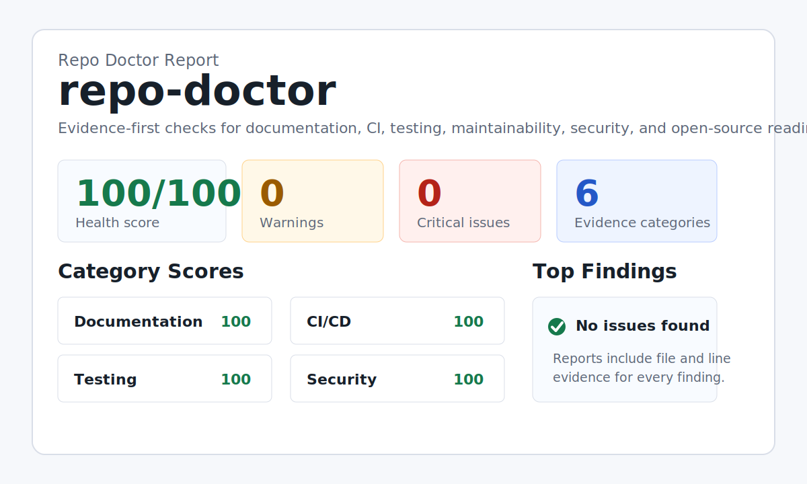

# Repo Doctor

Evidence-based repository health checks for real-world codebases.

Repo Doctor scans a local repository and produces a prioritized health report covering documentation, testing, CI, maintainability, security hygiene, and open-source readiness. It is designed to feel like a practical reviewer, not another dashboard full of raw metrics.



Current v0.4 runs without runtime dependencies. The scanner is deterministic first, AI-ready second: every finding is backed by structured evidence in `report.json`, so summaries can explain and prioritize issues without inventing facts.

Live demo page: https://davidwang1231.github.io/repo-doctor/

Repo Doctor now detects project profiles before scoring. A static game is not graded like an npm library, and skipped checks are explained in the report.

## Why This Exists

Existing tools are excellent at deep slices of repository quality:

- OpenSSF Scorecard evaluates open-source security posture.
- SonarQube performs deep static analysis and quality inspection.
- CHAOSS tools such as GrimoireLab and Augur/Aveloxis collect and analyze open-source community metrics.

Repo Doctor takes a smaller, sharper wedge: can a maintainer or contributor quickly understand, run, test, and safely modify this repository?

## Quick Start

### Installation

Install from npm:

```bash
npm install -g @davidwang1231/repo-doctor
```

Then run:

```bash
repo-doctor scan https://github.com/owner/repo
```

Or run it once without a global installation:

```bash
npx @davidwang1231/repo-doctor scan https://github.com/owner/repo
```

You can also clone or download the repository from GitHub and run it directly from source.

### Web Mode

Start the local web scanner:

```bash
repo-doctor web
```

Or from source:

```bash
npm run web
```

This opens a browser page where you can paste a local project path or a public GitHub URL, run a scan, and download:

- `report.html`
- `report.md`
- `report.json`
- `summary.md`
- `fix-prompt.md`

On macOS, you can also double-click:

```text
Repo Doctor Web.command
```

On Windows, double-click:

```text
Repo Doctor Web.cmd
```

Web mode runs on your own machine by default at `127.0.0.1`. It is a local UI over the same scanner used by the CLI.

### One-Click Mode

On macOS, double-click:

```text
Repo Doctor.command
```

On Windows, double-click:

```text
Repo Doctor.cmd
```

Then drag a project folder into the terminal window, paste a GitHub URL, or press Enter to scan Repo Doctor itself.

One-click mode will:

- scan the project
- generate HTML, Markdown, JSON, and summary reports
- open the HTML report automatically
- avoid changing the scanned project

Reports are saved under:

```text
repo-doctor-runs/
```

### Command Mode

Run a scan from the terminal:

```bash
node ./src/cli.js scan .
```

Scan a public GitHub repository URL:

```bash
node ./src/cli.js scan https://github.com/owner/repo
```

The default output directory is `repo-doctor-report/`:

```text
repo-doctor-report/
  report.html
  report.json
  report.md
```

Use a custom output directory:

```bash
node ./src/cli.js scan ../my-project --out doctor-report
```

Fail CI when the score is below a threshold:

```bash
node ./src/cli.js scan . --fail-under 75
```

Generate a priority summary from the structured report:

```bash
node ./src/cli.js summarize repo-doctor-report/report.json
```

Export a prompt for an AI coding assistant:

```bash
node ./src/cli.js prompt repo-doctor-report/report.json
```

Override project type when automatic detection is wrong:

```bash
node ./src/cli.js scan . --profile static-game
```

Preview low-risk fixes:

```bash
node ./src/cli.js fix .
```

Create the missing low-risk files:

```bash
node ./src/cli.js fix . --write
```

## What It Checks

- README presence, onboarding sections, and package script mismatches
- test files and standard test commands
- GitHub Actions workflows and pull request validation
- license, contribution guide, security policy, and `.gitignore`
- committed `.env` files and missing `.env.example`
- possible hard-coded secrets and dynamic execution patterns
- very large files that also show signals of mixed responsibilities, plus TODO/FIXME debt
- Docker local workflow hints
- TypeScript configuration basics

## Project Profiles

Repo Doctor first identifies the kind of repository it is looking at, then applies rules that fit that profile.

Current profiles include:

- `static-game`: a browser game or GitHub Pages demo built around `index.html`, canvas, and browser game-loop signals
- `static-site`: a simple static website
- `cli-tool`: a package with a command-line entry point
- `web-app`: a frontend app with build or dev scripts
- `backend-service`: an API or server-side service
- `library`: a reusable package with exports, main, module, or type entry points
- `python-project`: a Python repository
- `docs-only`: a documentation-heavy repository
- `generic`: fallback when no stronger profile is detected

Rules adapt to the profile. For example, a static game is not penalized for missing unit tests, `SECURITY.md`, or `CONTRIBUTING.md` when those checks do not fit the project. Instead, Repo Doctor focuses on things that matter for that repository type, such as playable documentation, GitHub Pages safety, syntax checks, and `.gitignore`.

## Low-Risk Fixes

`repo-doctor fix` only creates missing files. It does not overwrite existing files.

Current fixers can create:

- `.env.example` from environment variable references
- `.github/pull_request_template.md`
- `.github/ISSUE_TEMPLATE/bug_report.md`
- `.github/workflows/ci.yml` from Node package scripts

## Priority Summary

`repo-doctor summarize` reads `report.json` and writes `summary.md`, a compact repair plan that stays grounded in file and line evidence. It also includes an AI handoff prompt for turning the structured report into a narrative plan without inventing facts.

## Example Output

```text
Repo Doctor scanned repo-doctor
Health score: 86/100
Findings: 0 critical, 2 warnings, 5 total
Outputs:
- repo-doctor-report/report.json
- repo-doctor-report/report.md
- repo-doctor-report/report.html
```

Each finding includes evidence:

```text
[warning] README references package scripts that do not exist
Evidence:
- README.md:42
- package.json:8
```

The AI fix prompt is designed for handing the report to another coding agent. It tells the agent to use only Repo Doctor evidence, inspect referenced files first, skip checks that are not relevant for the detected project type, and make small reviewable fixes.

## GitHub Action

Use it in another repository:

```yaml
name: Repo Doctor

on:
  pull_request:
  push:
    branches:
      - main

permissions:
  contents: read
  pull-requests: write

jobs:
  repo-doctor:
    runs-on: ubuntu-latest
    steps:
      - uses: actions/checkout@v4
      - uses: DavidWang1231/repo-doctor@v0.4.3
        with:
          path: "."
          output: "repo-doctor-report"
          fail-under: "75"
          comment: "true"
          github-token: ${{ secrets.GITHUB_TOKEN }}
```

## Configuration

v0.4 intentionally has no configuration file. The rule set is fixed while the project proves the core workflow. If auto-detection gets the project type wrong, use `--profile <id>` or the Web Mode project-type dropdown.

Planned configuration support:

```json
{
  "failUnder": 75,
  "ignore": ["docs/generated/**"],
  "rules": {
    "large-source-files": "warning",
    "security-policy-missing": "off"
  }
}
```

## Development

Run syntax checks:

```bash
npm run lint
```

Run tests:

```bash
npm test
```

Scan this repository:

```bash
npm run doctor
```

Build the priority summary:

```bash
node ./src/cli.js summarize examples/self-scan/report.json --out examples/self-scan/summary.md
```

## Design Principles

- Evidence before opinion.
- Deterministic checks before AI interpretation.
- Reports should be useful in a terminal, a pull request, and a browser.
- Findings should point to a next action, not just a score.
- The tool should stay easy to run in a fresh repository.

## Roadmap

See [docs/ROADMAP.md](docs/ROADMAP.md).

## License

MIT
